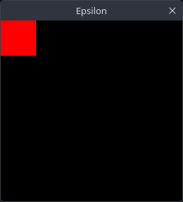
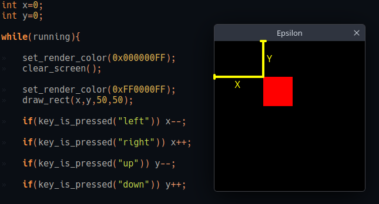

# EPSILON: GETTING STARTED
In this short document we will see how epsilon works by showing off how to make a simple 4 ways movement project.
###### This document assumes the final user knows basic C programming.
###### Also, is strongly recommended to download the engine.

# MAKING A BASIC PROJECT
### 1. The main.c file
When you clone the Epsilon repository, you'll find there's already a main.c file created, this is a **boilerplate** that generates a totally functional game window (that can also be modified as you like) and a basic **game loop**.
When you open it you'll find this:

~~~c
#include <stdio.h>
#include "epsilon/engine.h"

int main(int argc, char *argv){

	setup_epsilon();

	window win;
	win.title="Epsilon";
	win.w=256;
	win.h=256;

	create_window(&win);

	while(running){

		clear_screen();

		render();
		end_frame();
		check_close_button();
	}

	return 0;
}
~~~
Let's break down what everything here does:
|  Function |  Description |
|---|---|
|  #include "epsilon/engine.h" |  Includes the engine itself. |
|  setup_epsilon(); |  Sets up everything that Epsilon needs to work. |
|  	window win; |  Creates a Window object (this doesn NOT open a window). |
|  create_window(&win); |  Actually creates the window based on the object we made. |
|  while(running) |  The actual game loop, set running=false to close the game. |
|         clear_screen();        |                               Clears the screen using a solid color (selected *with set_render_color()* ).                               |
|         render();        |                               Displays all drawings into the window.                              |
|         end_frame();        |                               Waits for 16.66 ms (also known as 1000/60 seconds or 60 FPS).                              |
|         check_close_button();        |                               Closes the window if the close button is pressed.                              |

### 2. Drawing something
Before making anything related to movement, we need to show something in the screen, something that will represent our player.
~~~c
 
 int x=0; // our player's X position
	int y=0; // our player's Y position

	while(running){

		set_render_color(0x000000FF); // sets render color to black
		clear_screen();

		set_render_color(0xFF0000FF); // sets render color to solid red
		draw_rect(x,y,50,50); //draws a 50x50 pixels rectangle on "x" and "y" position 

		render();
		end_frame();
		check_close_button();
	}

	return 0;
~~~
The result:

as we can see, a 50 pixels wide and 50 pixels tall square is being rendered on x=0 y=0.

Q: Why is it on the top-left corner?
A: Epsilon's origin (also known as the 0,0 point) is setted up on the top-left corner, and it's the default origin for rectangles and textures.

### 3. Movement
Finally, we check inputs and move the player based on simple conditions.

~~~c
		if(key_is_pressed("left")) x--;

		if(key_is_pressed("right")) x++;

		if(key_is_pressed("up")) y--;

		if(key_is_pressed("down")) y++;
~~~
Pretty simple, right? notice that when the **up** key is pressed, **y** decreases and vice-versa. This is actually the correct way to do it, since the origin in Epsilon is on the top-left corner, adding to the **y** axis will make our player to move down, and decreasing **y** will make it move up.

In short, we change 2 variables if a key is pressed, and now our player moves.

# THE COMPLETE CODE:
~~~c
#include <stdio.h>
#include "epsilon/engine.h"

int main(int argc, char *argv){

	setup_epsilon();

	window win;
	win.title="Epsilon";
	win.w=256;
	win.h=256;
	create_window(&win);

	int x=0;
	int y=0;

	while(running){

		set_render_color(0x000000FF);
		clear_screen();

		set_render_color(0xFF0000FF);
		draw_rect(x,y,50,50);

		if(key_is_pressed("left")) x--;

		if(key_is_pressed("right")) x++;

		if(key_is_pressed("up")) y--;

		if(key_is_pressed("down")) y++;

		render();
		end_frame();
		check_close_button();
	}

	return 0;
}

~~~
This is the basics of the basics, is absolutely recommended to go check all function definitions, how they're used, examples, and more.